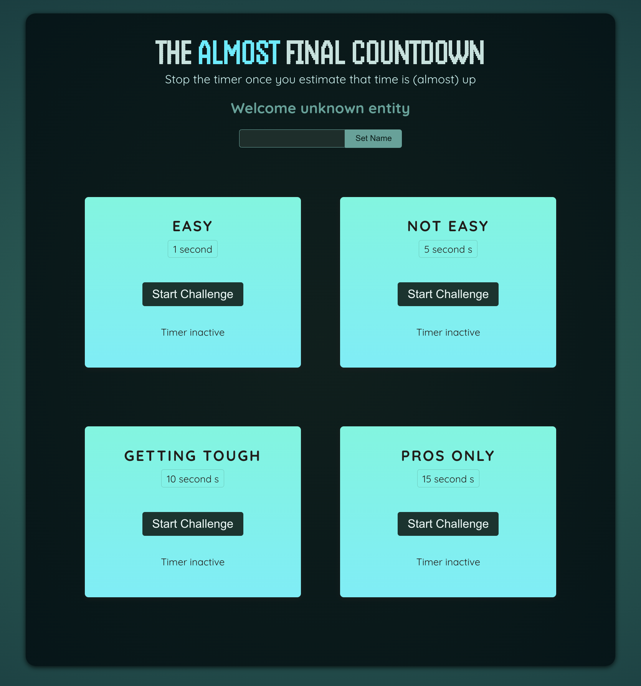

# App Overview

A count-down-timer game that allows player to start and stop any timer challenges before they stop by themselves. When player stop a timer, they get the higher score when the closer to timeout the timer is. If the player has started a timer and didn't stop it before it timed out, the player will lose.

- Live URL (Hosted with Firebase): https://stop-timer-game.web.app/

## User Story

A player wants to challenge themself by stopping a count-down timer at its closest to timeout as possible.

## Techniques applied

- Handling user input by using the 2-way binding technique
- Connecting & accessing HTML elements via refs
- Manipulating the DOM via refs instead of regular variables
- Using refs for more than "DOM Element Connections"
- Forwarding refs to custom components
- Exposing component APIs via the useImperativeHandle() Hook
- Using "Portals" (createPortal) to inject JSX to a specific HTML element -- commonly used for modal/backdrop of a <dialog> element

## Technologies Used

- React: useState(), useRef(), forwardRef(), useImperativeHandle(), createPortal()
- JavaScript
- HTML 5
- CSS

Note: I coded along while following React course by Academind @ https://github.com/academind
